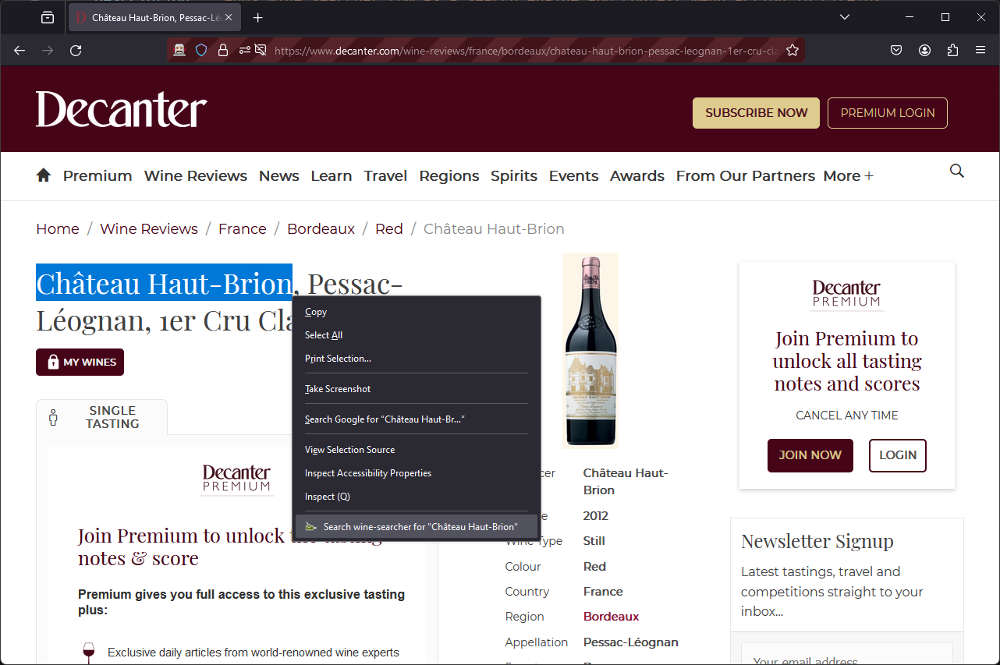

# wine-searcher firefox extension

This firefox extension adds 2 helpful features for quickly searching on wine-searcher.

1. Adds a "Search wine-searcher for {{wine_name}}" context menu action (right click menu)
   - This lets you highlight text + right click and query on wine-searcher
1. Adds wine-searcher as a custom search engine with the shortcut keyword `@ws`
   - This lets you use the shortcut in the searh bar and send a query to wine-searcher

